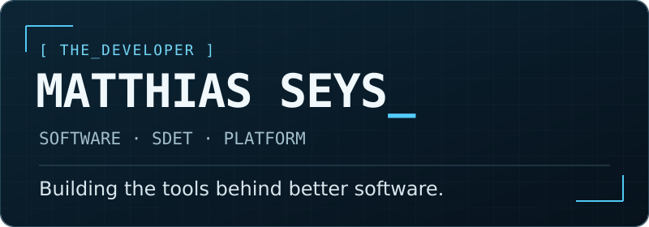
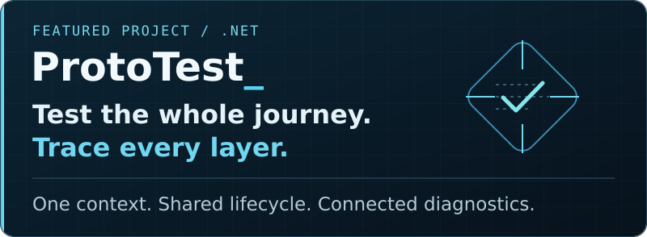
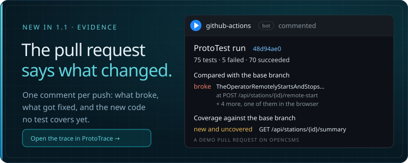
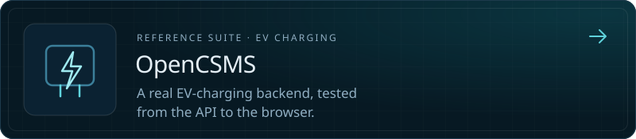
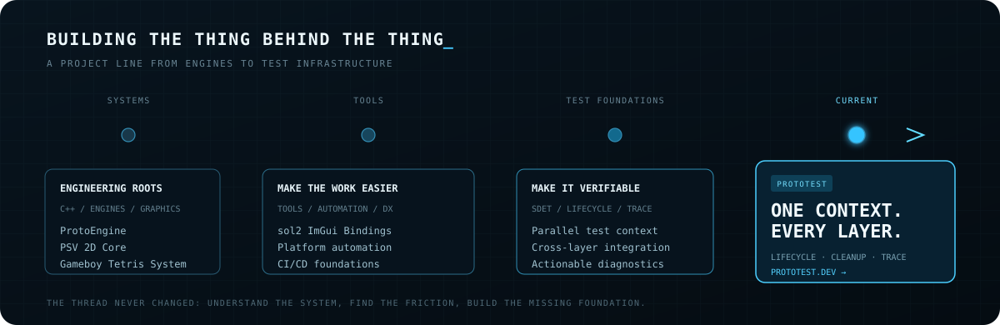
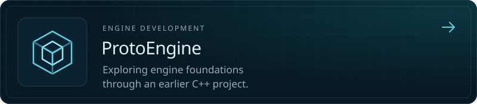
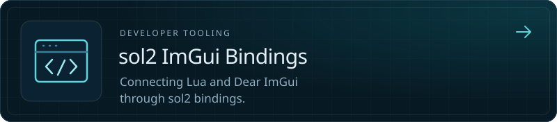
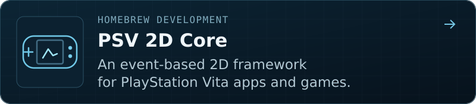
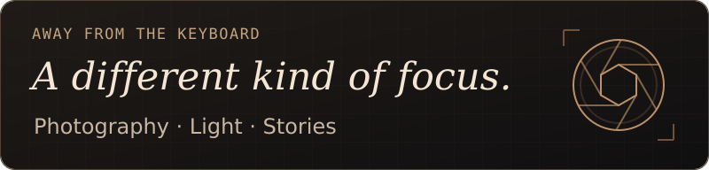

<a href="https://matthiasseys.com"></a>

<p align="center">
  <a href="https://dev.matthiasseys.com">Developer portfolio</a> &nbsp;·&nbsp;
  <a href="https://prototest.dev">ProtoTest</a> &nbsp;·&nbsp;
  <a href="https://trace.prototest.dev/?demo=1">Sample trace</a> &nbsp;·&nbsp;
  <a href="https://prototest.dev/blog">Blog</a> &nbsp;·&nbsp;
  <a href="https://photos.matthiasseys.com">Photography</a>
</p>

Hi, I’m Matthias — a software, SDET and platform engineer from Belgium.

I like building the things that help other developers work: tools, test infrastructure and shared foundations. My background spans C++ engine projects, .NET development, test automation and platform engineering.

> For every problem, there’s a solution. If there are none… create one.

## Building now

<a href="https://prototest.dev"></a>

**[ProtoTest](https://prototest.dev)** brings the setup around an integration test into one place. APIs, databases, messaging, browsers, devices and generated files share the same test context, lifecycle and cleanup.

**[ProtoTrace](https://trace.prototest.dev/?demo=1)** keeps the setup, requests, checks and teardown together, so a failure comes with the story of what happened.

New in 1.1: an MCP server and a CLI that compare two runs and call a coding agent’s fix *proven* only when the test failed before, passes now and nothing else broke. It is a preview, and it works from the same trace.

[Source](https://github.com/MSeys/ProtoTest) · [Get started](https://prototest.dev/docs/getting-started/installation) · [NuGet](https://www.nuget.org/packages?q=ProtoTest) · [Explore a sample trace](https://trace.prototest.dev/?demo=1) · [Why nobody trusts their integration tests](https://prototest.dev/blog/why-nobody-trusts-their-integration-tests)

<details>
<summary><strong>See ProtoTest in action — REST meets GraphQL</strong></summary>

This example creates a project through REST and checks the collection through GraphQL. `SignedInAs` is application-specific setup; both clients use the same test context.

```csharp
[ProtoTest]
[SignedInAs]
public async Task RestWritesAreVisibleThroughGraphQL()
{
    using var created = await Proto.Context.Rest()
        .Body(new CreateProjectRequest("atlas"))
        .PostAsync("/api/v1/projects");

    created.Should.HaveHttpStatus(HttpStatusCode.Created);

    using var projects = await Proto.Context.GraphQL()
        .Query("projects", new { first = 10 })
        .ExpectAsync(new { totalCount = 1 });

    projects.Should.HaveNoErrors();
}
```

[See the documentation for setup and complete examples.](https://prototest.dev/docs/recipes/overview)

</details>

### In every pull request

<a href="https://trace.prototest.dev/?trace=https://raw.githubusercontent.com/MSeys/MSeys/main/traces/opencsms-demo-pr.prototrace"></a>

The **[ProtoTest Evidence](https://github.com/marketplace/actions/prototest-evidence)** action compares a pull request’s run with the base branch and posts one comment that later pushes update: what broke, what got fixed, and which new code no test covers. The comment above is from a [demo pull request on OpenCSMS](https://github.com/MSeys/OpenCsms/pull/1), built to break on purpose. Click it to open that run in the viewer.

### A real product behind it

<a href="https://github.com/MSeys/OpenCsms"></a>

**[OpenCSMS](https://github.com/MSeys/OpenCsms)** is a small but real EV charging management system: a REST API, PostgreSQL, workers on RabbitMQ and an operator dashboard. Its suite is how I find out what ProtoTest still gets wrong. [Open a full run in the viewer](https://trace.prototest.dev/?demo=opencsms).

## The thread



## Things I’ve built

Some earlier projects — different platforms, the same interest in how things work underneath.

<a href="https://github.com/MSeys/ProtoEngine"></a>

<a href="https://github.com/MSeys/sol2_ImGui_Bindings"></a>

<a href="https://github.com/MSeys/PSV_2DCore"></a>

Also: **[Gameboy Tetris System](https://github.com/MSeys/GameboyTetrisSystem)** — a Tetris-playing system that only uses the Game Boy’s virtual screen and buttons.

[Explore the rest of my portfolio →](https://dev.matthiasseys.com/#project)

## Beyond code

<a href="https://photos.matthiasseys.com"></a>

I also enjoy telling stories through photography. **[Visit my gallery →](https://photos.matthiasseys.com)**
