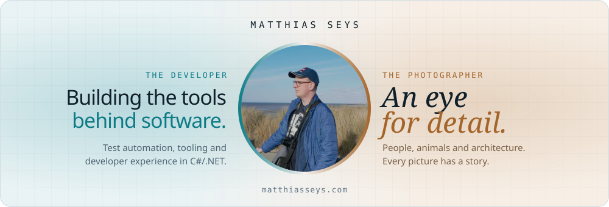
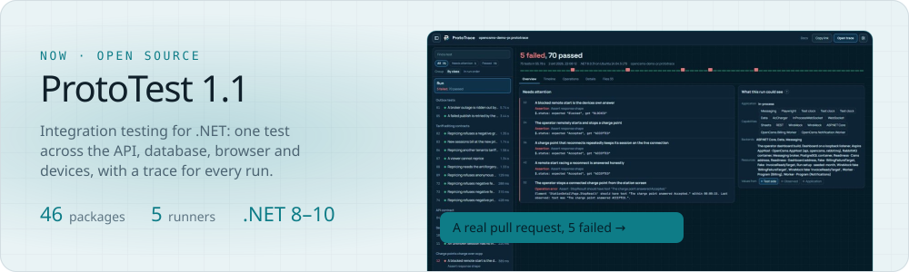
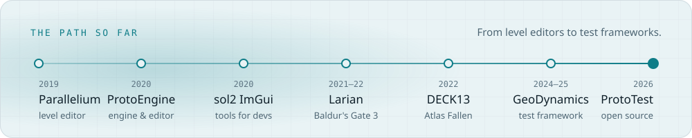

<a href="https://matthiasseys.com">
  <picture>
    <source media="(prefers-color-scheme: dark)" srcset="./assets/header-dark.svg">
    
  </picture>
</a>

  <b>Software, SDET and platform engineer</b> · Kortrijk region, Belgium 
  Open to roles in test architecture, automation and tooling · hybrid

  <a href="mailto:matthiasseys@gmail.com">Email</a> &nbsp;·&nbsp;
  <a href="https://www.linkedin.com/in/matthias-seys/">LinkedIn</a> &nbsp;·&nbsp;
  <a href="https://cv.matthiasseys.com">CV</a> &nbsp;·&nbsp;
  <a href="https://dev.matthiasseys.com">Portfolio</a>

I build the tools behind software: test infrastructure, developer tooling and the foundations that make complex systems easier to understand, verify and ship. Before that I built editor and engine tools for *Baldur's Gate 3* and *Atlas Fallen*.

## Now

<a href="https://dev.matthiasseys.com/projects/prototest/">
  <picture>
    <source media="(prefers-color-scheme: dark)" srcset="./assets/now-dark.svg">
    
  </picture>
</a>

**[ProtoTest](https://prototest.dev)** puts everything around an integration test in one place, and every run writes a trace that explains what happened. 

[Docs](https://prototest.dev) · [GitHub](https://github.com/MSeys/ProtoTest) · [Open a real pull-request run](https://trace.prototest.dev/?trace=https%3A%2F%2Fraw.githubusercontent.com%2FMSeys%2FMSeys%2Fmain%2Ftraces%2Fopencsms-demo-pr.prototrace) · [The framework that came before it](https://dev.matthiasseys.com/projects/geodynamics-test-framework/)

## The path so far

<a href="https://dev.matthiasseys.com/#projects">
  <picture>
    <source media="(prefers-color-scheme: dark)" srcset="./assets/path-dark.svg">
    
  </picture>
</a>

[Parallelium](https://dev.matthiasseys.com/projects/parallelium/) · [ProtoEngine](https://dev.matthiasseys.com/projects/protoengine/) · [sol2 ImGui Bindings](https://dev.matthiasseys.com/projects/sol2-imgui-bindings/) · [Larian and DECK13](https://dev.matthiasseys.com/#career) · [GeoDynamics](https://dev.matthiasseys.com/projects/geodynamics-test-framework/) · [ProtoTest](https://dev.matthiasseys.com/projects/prototest/)

## Writing

<!-- BLOG-POST-LIST:START -->- [Why nobody trusts their integration tests](https://prototest.dev/blog/why-nobody-trusts-their-integration-tests/)
- [Why ProtoTest 1.0 shipped too early](https://prototest.dev/blog/why-1-0-shipped-too-early/)
<!-- BLOG-POST-LIST:END -->

## Beyond code

  
  
  

I also photograph people, animals and architecture: **[photos.matthiasseys.com](https://photos.matthiasseys.com)**
